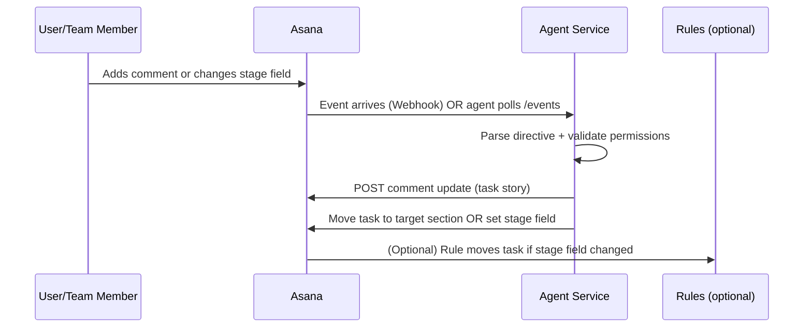

# Building an Asana Maintenance Agent for Comment Updates and Kanban Routing

## Executive summary

You can build a high-leverage Asana agent by combining three capabilities into one controlled workflow: a **directive parser** (detects intent like “proceed with implementation” or “feedback point needed”), a **comment writer** (posts a consistent, readable status snippet), and a **Kanban router** (moves tasks into the correct workflow stage/section). Asana’s own workflow model maps well to this: **sections can represent stages** in both list and board views, and rules can automate moves through stages. citeturn0search5turn0search4

The cleanest MVP is: **(1) listen for new comments or status changes → (2) parse directive → (3) add/update a standardized “agent update” comment → (4) move the task to the correct section (or set a stage field that triggers an Asana rule).** You can implement the agent with either **webhooks** (near real-time, requires a public endpoint and signature verification) citeturn2search0 or the **events endpoint** (polling with a sync token, simpler to host but less real-time). citeturn2search5

Since you plan to build with Claude Code, set the project up so Claude has persistent instructions via `CLAUDE.md`; Anthropic recommends keeping that file concise and using `/init` to bootstrap it. citeturn1search0 Claude Code is designed to work directly in your terminal and use your CLI tools, which fits building a small integration service. citeturn0search3

## How the agent should behave in your two-board setup

### What you want the agent to do

You described two core outcomes:

- **Maintain hygiene and momentum** by writing short, consistent update snippets as task comments (so anyone can scan what changed, what’s next, what’s blocked).
- **Route work through Kanban** based on explicit intent signals like:
  - “proceed with implementation”
  - “feedback point needed”

Asana supports using **sections as workflow stages** (e.g., Triage → In Progress → Approval Needed → Completed), and these stages map directly to the project’s sections in list/board views. citeturn0search5turn0search0

### Recommended workflow loop



Key idea: your agent becomes the “translator” between human intent and consistent task state, while Asana stays the system of record.

## A practical interaction design that won’t overwhelm your team

### Use a small directive vocabulary

Make the agent respond only to a small, explicit vocabulary. This reduces false positives and makes adoption easy.

A simple mapping table:

| User phrase (detected) | Routed stage (concept) | Suggested Asana section name |
|---|---|---|
| `proceed with implementation` | Ready / In progress | `Implementation` (or `In Progress`) |
| `feedback point needed` | Needs review/feedback | `Needs Feedback` |
| `blocked:` (plus reason) | Blocked | `Blocked` |
| `ready for review` | Review | `Review` / `QA` |
| `done` / `completed` | Complete | `Completed` |

Asana rules can also move tasks automatically when a workflow stage field changes, which can pair well with your directive approach. citeturn0search4turn0search7

### Standardize the “update snippet” comment format

Have the agent post a comment that humans recognize instantly as a structured update. You want it short, consistent, and clearly attributable.

Example comment template:

```text
🤖 Agent Update (Asana Hygiene)

Status: Needs Feedback
Why now: Feedback requested on <what/where>
Progress since last update:
- <1–3 bullets>

Next actions:
- <owner>: <action> (due: <date or TBD>)

Risks / Blockers:
- <none> OR <blocker + impact>

Directive processed: feedback_point_needed
```

Implementation note: comments in Asana are “stories.” The Asana endpoint for creating a comment story is `POST /tasks/{task_gid}/stories`, and it requires the `stories:write` scope. citeturn0search2

### Prevent spam by enforcing an idempotency rule

Adopt one simple rule:

- **One agent update comment per task per directive-event**, unless the directive changes.

This prevents repeated posts when events retry (common with webhooks). Asana explicitly notes webhook deliveries can retry on failure and that you should design for that. citeturn2search0

## Implementation blueprint you can build with Claude Code

### Minimal architecture

A small service is enough:

- **Receiver**: webhook endpoint (preferred if you can expose it) OR polling worker using `/events`
- **Parser**: extracts directive + optional structured metadata
- **Writer**: posts the formatted update comment (story)
- **Router**: moves task to target section (Kanban) or sets a stage field value (then Asana rules move it)

If you can’t host a public endpoint initially, start with polling using the events endpoint. Asana’s `/events` returns events since a sync token; it limits a sync token to 100 events and can indicate more events with `has_more`. citeturn2search5

### Core Asana operations you’ll implement

Create comment (update snippet):

- `POST /tasks/{task_gid}/stories` (“Create a story on a task”), scope `stories:write`. citeturn0search2

Move task into a Kanban section (column):

- `POST /sections/{section_gid}/addTask` (“Add task to section”), scope `tasks:write`. It removes the task from other sections of that project, which is typically what you want for a single Kanban state. citeturn0search6

### Picking “section-based routing” vs “custom-field stage + rules”

Two workable patterns:

- **Direct section move by the agent**: simplest and explicit; the agent calls `addTask` on the target section. citeturn0search6  
- **Agent sets a workflow stage custom field, Asana rules move tasks**: useful if you want humans to also change stages manually and keep behavior consistent; Asana documents a pattern where rules move tasks to the appropriate section when the workflow stage changes. citeturn0search4

If your team already uses a “Workflow stage” field, the second pattern often scales better.

### Claude Code setup for building this quickly

Add a `CLAUDE.md` at the repo root so Claude works consistently across sessions; Anthropic describes `CLAUDE.md` as project instructions that become part of Claude Code’s system prompt, and recommends starting with `/init` and iterating. citeturn1search0

A starter `CLAUDE.md` for your agent repo:

```md
# Curaden Asana Hygiene Agent

## Goal
Maintain Asana task hygiene by:
1) posting structured update comments
2) routing tasks to correct Kanban sections based on explicit directives

## Conventions
- Never move a task unless directive is explicit (approved vocabulary)
- Never post more than 1 agent-update comment per directive event
- Log every write action (task_gid, action, timestamp, hash)

## Commands
- npm test
- npm run dev
- npm run lint

## Safety
- Require an allowlist of directive authors (emails/user IDs) for routing actions
- Dry-run mode enabled by default in dev
```

Claude Code is designed to work in-terminal and use CLI tools; that’s a good fit for iterating quickly on a small Node/Python service. citeturn0search3

## Eventing, governance, and safety controls

### Webhooks mode (preferred once stable)

Asana’s webhook guide highlights:

- Webhook payloads include an `X-Hook-Signature` header (HMAC SHA256) and recommends verifying it to ensure authenticity. citeturn2search0  
- Events are compact; you typically fetch the latest state via API calls. citeturn2search0  
- Deliveries can retry with exponential backoff. citeturn2search0  

Practical governance rules you should implement:

- Only accept directives from:
  - specific users (allowlist) or
  - comments starting with a prefix like `@agent` or `CMD:`
- Require “dry run” for the first week (agent comments what it *would* do, but doesn’t move tasks).
- Keep an audit log: what was changed, why, and which directive triggered it.

### Polling mode (good MVP)

Use `/events` to pull changes since a sync token. Asana documents that it returns events since the token and limits one token to 100 events, with `has_more` for overflow. citeturn2search5

This mode is simpler to deploy internally because it can run on a schedule without receiving inbound internet traffic.

## Build plan you can follow

### Phase one MVP

- Define your directive vocabulary + mapping to your two board states (the table above).
- Build a polling worker:
  - read project events
  - detect new comments
  - parse directive
  - in dry-run: post “Agent would move this task to X”
- Implement comment creation via `POST /tasks/{task_gid}/stories`. citeturn0search2

**Verification (MVP):**
- 10 tasks processed correctly
- 0 accidental moves
- 100% of agent comments follow your template

### Phase two routing

- Implement section movement using `POST /sections/{section_gid}/addTask`. citeturn0search6  
- Add idempotency based on: `(task_gid, directive_type, directive_source_event_id)` so retries don’t spam or re-move.

**Verification:**
- 20 directive events, 20 correct moves
- No duplicate agent update comments for the same directive event

### Phase three webhook upgrade

- Implement a webhook receiver that verifies `X-Hook-Signature`. citeturn2search0  
- Switch from polling to webhook events.

**Verification:**
- Webhook signature verification active
- Backoff/retry safety tested (simulate downtime)

## A suggested “directive grammar” that works in real life

To prevent ambiguity, define **one canonical format** that humans can copy/paste:

```text
CMD: proceed_with_implementation
Owner: @name
Next: implement <thing>
Due: YYYY-MM-DD
```

Or for feedback:

```text
CMD: feedback_point_needed
Feedback from: @name
Question: <1 sentence>
```

The agent can treat anything outside `CMD:` lines as narrative and ignore it.

This keeps routing intentional and makes the system predictable.

---

If you want, I can also provide a ready-to-drop repository skeleton (file tree + sample Node/Python implementation) and a set of unit tests specifically for (1) directive parsing, (2) idempotency, and (3) section routing using the Asana endpoints above.