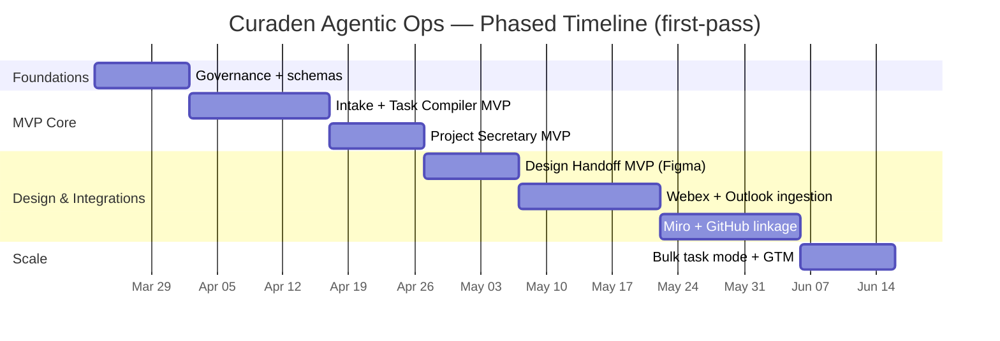

# Curaden Agentic Ops Framework for Claude Code + ChatGPT/Codex

## Executive summary

Curaden’s 2026 internal materials already point to a clear “north star”: a **task-management system between Claude and Asana** that can **integrate with Asana (completion/updates, full project view or time-based view) and oversee the broader ecosystem**. fileciteturn2file0L1-L1 That direction is reinforced by a 2026 proposal to **embed Claude into the Curaden App Hub** (including guidance like using different Claude models by complexity and keeping a “liquid page” up to date). fileciteturn2file1L1-L1

Your stack reality (Miro, Webex, Outlook, Figma) suggests the highest-leverage MVP is not “more agents,” but **one reliable intake→normalize→taskify pipeline** plus **one reliable project memory + reporting loop**. The recommended build is a hybrid, where:

- **ChatGPT/Codex** specializes in planning, decomposition, spec drafting, and review/quality gates (Codex is explicitly designed for multi-agent coding workflows with isolated environments and can be guided via repo files like `AGENTS.md`). citeturn0search1turn0search3  
- **Claude Code** specializes in execution inside repos (it can edit files and run commands directly in the terminal environment, and is positioned as configurable while keeping the user “in control”). citeturn1search0turn1search2  
- **Asana + Notion** remain the system of record for work tracking and curated knowledge, aligned with your internal “Asana Processes” and “Process Governance” materials. fileciteturn2file2L1-L1 fileciteturn2file3L1-L1

Deliverables in this report include: one-line framing answers grounded only in 2026 internal docs; a recommended agent catalog (with ChatGPT vs Claude roles); a **GSD-style scaffold** (`PROJECT.md`, `REQUIREMENTS.md`, `ROADMAP.md`, `STATE.md`, `PLAN.md`); top-5 **Claude skill Markdown specs**; a phased roadmap with verification; an integration/security checklist; and a rough effort estimate.

## Curaden 2026 internal signals and framing answers

### Connector artifacts used from Curaden/Curaprox internal sources

Primary 2026 artifacts retrieved via enabled connectors (Notion, Asana; Atlassian Rovo search was blocked in this environment):

- **Notion**: “Claude Task Management” (created 2026-03-18; updated 2026-03-19). fileciteturn2file0L1-L1  
- **Notion**: “Proposal to Use Claude in Curaden App Hub” (created 2026-03-03; updated 2026-03-05). fileciteturn2file1L1-L1  
- **Notion**: “Asana Processes” (created 2026-03-05; updated 2026-03-15). fileciteturn2file2L1-L1  
- **Notion**: “Process Governance” (created 2026-03-20). fileciteturn2file3L1-L1  
- **Notion**: “Curaden App Hub” (database/registry of Curaden projects and artifacts; updated 2026-03-04). fileciteturn2file5L1-L1  
- **Asana**: workspace status overview queried for (Curaden/App Hub/App Requests/BOB). (Used for situational awareness; not quoted as authoritative policy.)

Atlassian Rovo: user identity call succeeded, but **Rovo search calls were blocked by the tool safety gate**, so no Confluence/Jira pages were incorporated into conclusions.

### One-line answers to the framing questions based only on 2026 Curaden/Curaprox internal docs

Core: **Build a Claude↔Asana task-management system that can update/complete tasks, provide time-based or full project views, and “oversee the entire ecosystem.”** fileciteturn2file0L1-L1  

Systems: **Use Asana as the work system, supported by documented Asana processes + governance, and a Curaden App Hub registry to centralize visibility across projects.** fileciteturn2file2L1-L1 fileciteturn2file3L1-L1 fileciteturn2file5L1-L1  

Roles: **Roles/ownership are not explicitly defined in the 2026 internal artifacts reviewed; this must be decided as part of governance setup.** fileciteturn2file3L1-L1  

Success: **Success is implied as: higher-quality task creation + consistent task completion/updates and “full project view/time-based view” visibility through the Claude↔Asana integration.** fileciteturn2file0L1-L1  

## Recommended architecture and agent set

### Architecture concept for Option A + Option B

Because your internal direction is “Claude + Asana task management” fileciteturn2file0L1-L1 while you also want ChatGPT to do heavy planning and Claude to execute, the most practical approach is to support **two operational modes** behind a single workflow. This keeps your org from being locked into one vendor/tool behavior.

Option A: **ChatGPT/Codex as Planner + Claude Code as Executor**  
- ChatGPT/Codex produces specs, task breakdowns, acceptance criteria, and review checklists; Codex is built for parallel, isolated engineering tasks and can be guided by repo configuration files. citeturn0search1turn0search3  
- Claude Code applies the plan in-repo with terminal commands, edits, and test runs, staying “user-in-control.” citeturn1search0turn1search2  

Option B: **Claude as Ops Orchestrator + ChatGPT/Codex as Specialist**  
- Claude owns the “operating system” loop: intake, normalization, Asana updates, and cross-tool syncing (consistent with the internal doc emphasis on Claude overseeing the ecosystem via Asana). fileciteturn2file0L1-L1  
- ChatGPT/Codex is invoked as a specialist for deep analysis, hard writing, and PR-like output. citeturn0search1turn0search0  

### System architecture diagram

```mermaid
flowchart TB
  subgraph Inputs
    W[Webex meetings & messages]
    O[Outlook email/calendar]
    M[Miro boards]
    F[Figma files/comments]
    N[Notion pages/databases]
    A[Asana projects/tasks]
    G[GitHub issues/PRs]
  end

  subgraph CorePlatform["Agentic Ops Core"]
    I[Intake Router\n(dedupe, classify, urgency)]
    K[Knowledge Sync\n(Notion + App Hub registry)]
    T[Task Compiler\n(normalize -> Asana tasks)]
    R[Project Secretary\n(status, STATE.md, reports)]
    P[Policy & Permissions Gate\n(least privilege + approvals)]
    Q[Queue/Event Bus\n(webhooks + retries)]
  end

  subgraph LLMs
    C1[ChatGPT/Codex\nPlan/Spec/Review]
    C2[Claude + Claude Code\nExecute/Implement]
  end

  Inputs --> I --> P --> Q
  Q --> T --> A
  Q --> K --> N
  Q --> R --> N
  T --> C1
  C1 --> C2
  C2 --> G
  R --> W
```

### Agent catalog

The table below prioritizes the agents you requested and assigns **ChatGPT vs Claude responsibilities** consistent with Option A + B.

| Agent | Purpose | Triggers | Inputs | Outputs | Required permissions (MVP) | Owner | ChatGPT vs Claude role split | MVP vs later |
|---|---|---|---|---|---|---|---|---|
| Intake | Single front door; capture requests from Webex/Outlook/manual form; classify + route | New message/email/meeting note; manual “/intake” | Webex transcript/summary, Outlook email, user form fields | Triage record + routing decision + draft task bundle | Read: Webex/Outlook; Write: Notion “Intake” db | Product Ops/PM | ChatGPT: classify, rewrite into structured brief; Claude: enforce templates + create records | MVP |
| Task Compiler | Convert briefs → clean Asana tasks with dependencies, owners, acceptance criteria | Intake accepted; weekly planning | Structured brief; links; constraints | Asana tasks, sections, dependencies; “Definition of Done” | Asana write scopes (tasks/projects) citeturn0search2 | PMO/Delivery | ChatGPT: decomposition + quality bar; Claude: apply mapping rules + push to Asana | MVP |
| Meeting Intelligence | Turn Webex meetings into decisions, actions, risks | Meeting ends; recording/transcript available | Transcript + attendee list + agenda | Decision log, action items, risk list; tasks to Asana | Webex read; Asana write; Notion write | Ops/EA + PM | ChatGPT: summarize + extract; Claude: enforce schema + create tasks/notes | MVP |
| Project Secretary | Maintain STATE.md / Notion STATE, weekly status, changelog; keep “liquid page” updated | Daily cron; after task updates; milestone changes | Asana task state; meeting decisions; repo changes | Status report; updated STATE; alerts for blockers | Asana read; Notion write | PM | ChatGPT: narrative status + exec summary; Claude: update STATE + publish | MVP |
| Design Handoff | Bridge Figma→engineering: extract specs, tokens, assets; create implementation tasks | Figma file updated; design ready; handoff request | Figma file link/comments | Handoff checklist + Asana tasks + eng brief | Figma read scopes citeturn2search1; Asana write | DesignOps + Eng lead | ChatGPT: translate design intent; Claude: enforce checklists + create tasks | MVP |
| Marketing/GTM | Convert feature milestones → launch plan assets | Milestone scheduled; release candidate | Feature brief + dates + channels | GTM checklist, copy drafts, UTM plan, launch tasks | Notion write; Asana write | Marketing lead | ChatGPT: drafts; Claude: taskify + publish plan | Later (after MVP) |
| Asana task-spammer | High-volume task creation from structured lists (safe bulk mode w/ approvals) | Approved bulk import; backlog grooming | CSV/JSON task list | Hundreds of tasks with correct fields | Asana write + rate limiting | PMO | ChatGPT: validate + dedupe; Claude: bulk create + error retry | Later (guarded) |
| Communication Channel agent | Post updates to Webex spaces; route alerts; reduce noise | Status published; blocker; incident | Report + target channels | Webex message posts + links | Webex write scopes (tight) | Ops | ChatGPT: craft minimal message; Claude: send + log | Later |

### Permission strategy you can enforce from day one

A secure “agentic ops” build depends less on model choice and more on **permission design** and **auditability**:

- Asana supports OAuth scopes structured as `<resource>:<action>` (e.g., `tasks:write`), and recommends using scopes where available. citeturn0search2  
- Notion internal integrations require **manual sharing** of pages/databases with the integration, limiting blast radius if you keep the integration scoped to only the relevant workspace pages. citeturn2search0  
- Claude Code emphasizes user control (no file modification without approval) and is positioned as configurable for workflows. citeturn1search0turn1search2  
- OpenAI’s Codex stack emphasizes sandboxing and permission boundaries (security-by-default framing), which supports safe “planner/reviewer” usage. citeturn0search3turn0search1  

## GSD-ready project scaffold

This section gives first-pass, concise content for the scaffolding files you requested. It’s styled to be compatible with GSD’s spec-driven workflow (PROJECT/ROADMAP/STATE/PLAN concepts are explicitly part of the GSD approach). citeturn5search1

### PROJECT.md

```md
# PROJECT: Curaden Agentic Ops (Claude ↔ Asana + ChatGPT/Codex)

## Vision
Create a reliable “operating system” for Curaden work that converts real-world inputs (meetings, emails, design updates) into clear, owned tasks and continuously maintains execution visibility.

## Primary outcome
A Claude↔Asana task management system that can:
- Create tasks with correct structure/quality
- Update/complete tasks consistently
- Provide time-based views and full project views across work
- Serve as the backbone to “oversee the ecosystem” of tools (Miro/Webex/Outlook/Figma/GitHub)

## Operating modes
- Option A: ChatGPT/Codex = Planner/Reviewer; Claude Code = Executor
- Option B: Claude = Orchestrator; ChatGPT/Codex = Specialist

## Non-goals (MVP)
- Full autonomous execution without human approval
- “Write access everywhere” integrations (default to read-only + explicit approvals)
- Replacing Asana/Notion; the system augments them

## Users
- PM/Delivery (primary)
- DesignOps (handoffs)
- Marketing/GTM (later)
- Engineering (execution)

## Success metrics
- Task quality: % tasks accepted without rewrite
- Cycle time: intake → first actionable task
- Reporting: weekly status auto-generated with <10 min human edits
- No-spam: notifications rate limited; high-signal updates only
```

### REQUIREMENTS.md

```md
# REQUIREMENTS: Curaden Agentic Ops

## Functional requirements (MVP)
R1 Intake capture:
- From Webex meeting transcript OR manual summary
- From Outlook email (forwarded to intake address) OR manual paste
- Create Intake record with: requester, date, context, urgency, links

R2 Task compilation:
- Convert Intake → Asana tasks with:
  - Title, description, acceptance criteria, owner, due date (if known)
  - Dependencies and grouping by project/section
- Must include dedupe (avoid duplicates within 14 days)

R3 Project memory + reporting:
- Maintain STATE (decisions, risks, blockers, current focus)
- Weekly status rollups per project and portfolio

R4 Design handoff:
- Given a Figma file link, produce implementation checklist + tasks

## Security & governance requirements (MVP)
S1 Least privilege OAuth scopes for each integration
S2 Audit log for: what was read, what was written, who approved
S3 Human approval gates:
- Bulk task creation
- Any repo write/PR creation
- Any message posting to broad Webex spaces

## Reliability requirements
Q1 Webhook/event failures retry with backoff
Q2 Idempotency keys for task creation
Q3 Rate limiting for Asana and messaging APIs
```

### ROADMAP.md

```md
# ROADMAP: Curaden Agentic Ops

## Phase 0 — Foundations
- Define governance: owners, allowed writes, approval rules
- Create Notion “App Hub” registry entries for this project
- Define schemas (Intake, TaskBundle, DecisionLog, StatusReport)

## Phase 1 — Intake + Task Compiler MVP
- Intake Router (manual + Webex meeting summary in v1)
- Task Compiler → Asana tasks (single target project first)
- Verification: 20 real intakes converted, >80% task acceptance

## Phase 2 — Project Secretary MVP
- STATE generation + weekly status report
- Verification: 4 weekly cycles; PM edits <10 minutes each

## Phase 3 — Design Handoff MVP
- Figma link → eng brief + tasks + checklist
- Verification: run on 5 design handoffs; engineering says “usable” (>=4/5)

## Phase 4 — Multi-source integrations + automation
- Outlook ingestion
- Webex posting (select channels)
- Miro board ingestion (links + decisions)
- GitHub linkage (issue/PR references)

## Phase 5 — Bulk modes + GTM
- Safe bulk task creation (“task-spammer” with approvals)
- Marketing/GTM agent (launch checklists)
```

### STATE.md

```md
# STATE: Curaden Agentic Ops

## Current milestone
MVP: Intake + Task Compiler + Project Secretary

## Decisions
- System of record for tasks: Asana
- System of record for knowledge/registry: Notion (App Hub)
- Option A will be implemented first; Option B supported by plugin interface

## Open questions
- Which Asana workspace/projects are in-scope for MVP?
- Who can approve “bulk create” and “external posting” actions?
- What Webex spaces/channels are allowed for automated posting?

## Risks
- Integration permissions too broad (mitigate via least privilege + approval)
- Task spam / noise (mitigate via rate limiting + thresholds)
- Model drift / inconsistent formatting (mitigate via schemas + validation)

## Next 2 weeks focus
- Finalize schemas and mapping rules
- Implement baseline workflow for 1 pilot project
```

### research/notes.md

```md
# research/notes

## Internal anchors (2026)
- Claude↔Asana task management direction (core requirement)
- Proposal to integrate Claude in App Hub (model selection + “liquid page” maintenance)
- Asana Processes + Process Governance (process + governance foundation)

## External anchors
- Codex: multi-agent workflow + sandboxing + repo guidance via AGENTS.md concept
- Claude Code: terminal execution, explicit approval, configurable workflows
- OAuth & scopes for each tool (Notion/Figma/Miro/Webex/Microsoft Graph)
```

### Per-phase PLAN.md template

```md
# PLAN: Phase <N> — <Name>

## Goal
One sentence.

## Inputs
- Links
- Docs
- Constraints

## Tasks (atomic)
1) <task>
   - Deliverable:
   - Verification:
2) <task>
   - Deliverable:
   - Verification:
3) <task>
   - Deliverable:
   - Verification:

## Definition of done
- Bullet list of measurable criteria
```

## Claude skill Markdown specs for the top skills

These are “Claude-ready” skill specs designed to be dropped into a skills folder (or adapted into your Claude Code/GSD structure). They assume you enforce a strict **I/O schema** and a **permission gate** around any writes.

### meeting-intelligence.md

```md
# Skill: meeting-intelligence

## Purpose
Convert a Webex meeting (transcript or notes) into:
- DecisionLog
- ActionItems (task candidates)
- Risks/Blockers
- Follow-ups and owners

## Trigger
- User provides a Webex meeting link, transcript, or pasted notes
- Or a scheduled “post-meeting” automation event

## Inputs (JSON)
{
  "meeting": {
    "title": "string",
    "date": "YYYY-MM-DD",
    "attendees": ["string"],
    "transcript": "string",
    "notes": "string|null"
  },
  "context": {
    "project": "string",
    "asana_project_gid": "string|null",
    "notion_page_id": "string|null"
  }
}

## Outputs (JSON)
{
  "decision_log": [
    {"decision": "string", "owner": "string|null", "due_date": "YYYY-MM-DD|null"}
  ],
  "action_items": [
    {
      "title": "string",
      "description": "string",
      "owner": "string|null",
      "due_date": "YYYY-MM-DD|null",
      "acceptance_criteria": ["string"],
      "links": ["string"]
    }
  ],
  "risks": [{"risk": "string", "mitigation": "string|null"}],
  "summary": "string",
  "confidence_notes": "string"
}

## Tooling & permissions
Read:
- Webex meeting transcript / pasted notes
Write (guarded):
- Asana tasks (only if approved)
- Notion decision log page/db (only if approved)

## ChatGPT vs Claude role split
- ChatGPT: extract and rewrite into structured outputs; propose tasks
- Claude: validate schema, enforce templates, push to Asana/Notion after approval

## Error handling
- If no transcript: ask for notes or agenda; output "insufficient_data" in confidence_notes
- If owners unclear: set owner=null and add follow-up question list

## Sample prompt
"Run meeting-intelligence on this transcript. Produce decisions and tasks. Keep tasks small and actionable."

## Verification tests
1) Given a short transcript with one decision and two action items, outputs contain:
   - 1 decision_log entry
   - 2 action_items
2) Outputs must be valid JSON and match the schema (no extra keys).
```

### task-compiler.md

```md
# Skill: task-compiler

## Purpose
Transform an Intake brief into a clean Asana task bundle:
- Task titles that are unambiguous
- Dependencies
- Acceptance criteria
- Correct project/section mapping

## Trigger
- New Intake record created
- Weekly backlog grooming
- Manual "/compile tasks" request

## Inputs (JSON)
{
  "intake": {
    "id": "string",
    "title": "string",
    "problem": "string",
    "desired_outcome": "string",
    "constraints": ["string"],
    "links": ["string"],
    "requested_by": "string",
    "urgency": "low|medium|high"
  },
  "asana": {
    "target_project_gid": "string",
    "default_section": "string|null"
  }
}

## Outputs (JSON)
{
  "task_bundle": {
    "epic_title": "string",
    "tasks": [
      {
        "title": "string",
        "description": "string",
        "owner": "string|null",
        "due_date": "YYYY-MM-DD|null",
        "dependencies": ["task_ref_id"],
        "acceptance_criteria": ["string"],
        "tags": ["string"]
      }
    ]
  },
  "dedupe": {"possible_duplicates": ["string"], "notes": "string"},
  "approval_required": true
}

## Tooling & permissions
Read:
- Intake record (Notion)
- Existing Asana tasks (for dedupe)
Write (guarded):
- Asana task creation with least-privilege scopes (tasks:write etc.) (Asana scopes are resource:action). 
  Reference: https://developers.asana.com/docs/oauth

## ChatGPT vs Claude role split
- ChatGPT: task decomposition + acceptance criteria
- Claude: enforce naming conventions + idempotency keys + push to Asana after approval

## Error handling
- If target_project_gid missing: set approval_required=true and request it
- If duplicate risk high: return tasks but set approval_required=true and include dedupe notes

## Sample prompt
"Compile tasks from this intake. Aim for 5–12 tasks max. Include acceptance criteria."

## Verification tests
- Schema validation
- Task titles must start with a verb (heuristic check)
- No task missing acceptance_criteria (must have >=1)
```

### project-secretary.md

```md
# Skill: project-secretary

## Purpose
Maintain a living project memory + reporting loop:
- Update STATE.md (or Notion STATE equivalent)
- Produce weekly status reports
- Detect blockers and stale work

## Trigger
- Daily scheduled run
- Weekly scheduled run
- After major task status changes

## Inputs (JSON)
{
  "project": {
    "name": "string",
    "asana_project_gid": "string",
    "notion_state_page_id": "string|null"
  },
  "time_window": {"start": "YYYY-MM-DD", "end": "YYYY-MM-DD"}
}

## Outputs (JSON)
{
  "state_update": {
    "current_focus": ["string"],
    "decisions": ["string"],
    "blockers": ["string"],
    "next_steps": ["string"]
  },
  "weekly_status": {
    "accomplished": ["string"],
    "in_progress": ["string"],
    "at_risk": ["string"],
    "asks": ["string"]
  },
  "publish_actions": {"update_notion": true, "post_webex": false}
}

## Tooling & permissions
Read:
- Asana project tasks/status
Write (guarded):
- Notion STATE page update
- Optional: Webex post (only in allowed channels)

## ChatGPT vs Claude role split
- ChatGPT: draft clean narrative and highlight decisions/risks
- Claude: apply structured update; maintain changelog and timestamps (“liquid page” upkeep)

## Error handling
- If Notion page missing, output publish_actions.update_notion=false and include remediation
- If Asana API limits occur, retry with backoff; partial status allowed

## Verification tests
- Weekly status must include at least one item in each of: accomplished/in_progress/asks (or explicitly "none")
- Output must be under a configured character/word limit for Webex posting
```

### design-handoff.md

```md
# Skill: design-handoff

## Purpose
Translate Figma designs into engineering-ready execution:
- Identify screens/flows
- Capture components, states, edge cases
- Create implementation tasks and acceptance criteria

## Trigger
- Figma file link posted
- “Handoff ready” label applied in Figma/Asana

## Inputs (JSON)
{
  "figma": {
    "file_url": "string",
    "focus_frames": ["string|null"],
    "comments_export": "string|null"
  },
  "project_context": {
    "feature_name": "string",
    "platform": "web|mobile|both",
    "existing_components": ["string"]
  }
}

## Outputs (JSON)
{
  "handoff_brief": {
    "overview": "string",
    "screens": [{"name":"string","states":["string"],"notes":"string"}],
    "edge_cases": ["string"],
    "open_questions": ["string"]
  },
  "asana_tasks": [
    {"title":"string","description":"string","acceptance_criteria":["string"]}
  ],
  "approval_required": true
}

## Tooling & permissions
Read:
- Figma REST API (OAuth app recommended; scopes like file_content:read). 
Write (guarded):
- Asana tasks

## ChatGPT vs Claude role split
- ChatGPT: interpret UX intent; draft acceptance criteria
- Claude: enforce checklists; convert to tasks; ensure missing info becomes questions

## Error handling
- If file access denied: output open_questions=["Need Figma access or export"]
- If comments missing: proceed but flag reduced confidence

## Verification tests
- Each task must reference a screen/frame name
- Each task must have >=2 acceptance criteria
```

### engineering-executor.md

```md
# Skill: engineering-executor

## Purpose
Execute implementation plans safely in a repo:
- Apply changes
- Run tests/linters
- Produce PR-ready output summary and verification evidence

## Trigger
- Approved PLAN.md exists for a phase/task
- “Implement” command invoked

## Inputs (JSON)
{
  "repo": {"path":"string", "branch":"string"},
  "plan": {"task_name":"string", "steps":["string"], "verify":["string"]},
  "constraints": {"no_network": true, "allowed_commands":["string"]}
}

## Outputs (JSON)
{
  "changes": [{"file":"string","summary":"string"}],
  "verification": [{"command":"string","result":"pass|fail","log_excerpt":"string"}],
  "next_actions": ["string"],
  "ready_for_pr": true
}

## Tooling & permissions
- Claude Code execution in terminal/repo (file edits + command execution)
- Must require explicit approval before modifying files; keep logs
  (Claude Code emphasizes user control, and direct terminal execution capability.)

## ChatGPT vs Claude role split
- ChatGPT/Codex: review plan; propose tests; do code review pass
- Claude Code: implement + run verifications + report

## Error handling
- If tests fail: attempt minimal fix loop (max 2 iterations), then stop and report
- If required command not in allowlist: request approval rather than running

## Verification tests
- Always run at least one verification command if provided
- Mark ready_for_pr=false if any verification fails
```

## Phased roadmap, milestones, and verification criteria

### Milestones table

| Phase | Milestone | What ships | Verification criteria |
|---|---|---|---|
| Foundations | Governance + schemas | Intake/Task/Decision/Status schemas; approval rules | Governance doc approved; schemas validated in 5 examples |
| Intake + Task Compiler MVP | Working task pipeline | Intake → TaskBundle → Asana tasks | 20 real intakes; >80% tasks accepted w/o rewrite; dedupe works |
| Project Secretary MVP | Weekly status automation | STATE updates + weekly status | 4 weeks; PM edits <10 min; no missing blockers |
| Design Handoff MVP | Figma→tasks | Handoff brief + tasks | 5 handoffs; engineering satisfaction >=4/5 |
| Multi-tool expansion | Outlook/Webex/Miro/GitHub | Webhooks + safe posting + link sync | No token leaks; stable retries; noise cap adhered |
| Bulk/GTM | Bulk + launch | Bulk task mode + GTM checklists | Bulk actions require approval; rate limits enforced |

### Timeline diagram



## Integration checklist and security/approval constraints

This checklist focuses on what is usually required to integrate each tool safely in an agentic system.

| System | Integration method | Key scopes/permissions | Security/approval constraints |
|---|---|---|---|
| Asana | OAuth app; scoped access | Scope structure is `<resource>:<action>` (e.g., tasks:write) citeturn0search2 | Rate limit + idempotency keys; bulk create must be gated |
| Notion | Internal integration or OAuth public integration | Internal integrations are workspace-bound; pages must be manually shared to the integration citeturn2search0 | Keep integration token secret; avoid committing tokens (Notion warns against storing in code) citeturn2search0 |
| Figma | OAuth app recommended (PAT optional) | OAuth apps support scoped access (example scope: `file_content:read`) citeturn2search1 | Prefer OAuth app so access is not tied to one person; admin reassignment supported citeturn2search1 |
| Miro | OAuth 2.0 | Access token used as `Authorization: Bearer ...`; access token expires (60 min) and refresh token (60 days) citeturn3search7 | Must manage refresh securely; separate environments (dev/prod) |
| Webex | OAuth “Integrations” | Use only scopes needed; Webex includes `spark:kms` for encrypted content in integrations citeturn5search5turn5search0 | Compliance scopes require compliance officer (e.g., `spark-compliance:events_read`) citeturn5search2 |
| Outlook | Microsoft Graph OAuth | Permissions must follow least privilege; Microsoft explicitly warns against over-privileging apps citeturn4search3 | Tenant consent policies and admin consent can affect rollout; plan for admin review citeturn4search1 |
| GitHub | Prefer GitHub App or fine-grained tokens | GitHub notes GitHub Apps preferred (fine-grained permissions); OAuth scopes limit access but don’t grant more than user has citeturn3search5turn3search9 | Use least privilege permissions; leverage required-permissions headers guidance citeturn3search2 |
| ChatGPT/Codex | Product integration + repo guidance | Codex designed as multi-agent coding system; can be guided via repo “AGENTS.md” concept citeturn0search1 | Keep clear boundaries: planning/review only unless explicitly approved |
| Claude Code | Terminal + repo execution | Claude Code positioned for direct terminal workflows, multi-file edits, and explicit approval controls citeturn1search0turn1search2 | Enforce allowlisted commands; capture logs for audit |

## Implementation estimate, effort, and key risks

### Rough effort estimate

A realistic first-pass estimate assuming 1 product owner + 2 engineers + 0.5 ops/design support:

- Foundations (governance + schemas + sandbox environment): **2–3 person-weeks**
- Intake + Task Compiler MVP (Asana + Notion + basic UI/form): **4–6 person-weeks**
- Project Secretary MVP (weekly status + STATE updates): **2–3 person-weeks**
- Design Handoff MVP (Figma): **3–4 person-weeks**
- Multi-tool expansion (Outlook + Webex + Miro + GitHub linkages): **6–10 person-weeks**
- Bulk/GTM features: **2–4 person-weeks**

Total to a robust cross-tool v1: **~19–30 person-weeks** (about 2–4 calendar months with a small team, depending on integration complexity and approvals).

### Key risks and mitigations

The highest risks are operational, not model quality:

- Permission sprawl and accidental overreach: mitigate with least privilege and explicit approval gates; Microsoft Graph explicitly highlights least privilege as a security best practice. citeturn4search3  
- Noise/task spam: keep bulk creation as “later,” add rate limits, dedupe, and human review thresholds; internal “Process Governance” should own this policy layer. fileciteturn2file3L1-L1  
- Integration rollover and token handling: use secure secret storage; Notion explicitly warns to keep tokens secret and avoid hardcoding/committing them. citeturn2search0  
- Developer workstation compromise (Claude Code impersonation / malware risk): recent reporting highlights attackers disguising “Claude Code” downloads; enforce approved install sources and endpoint protection. citeturn1news48  

